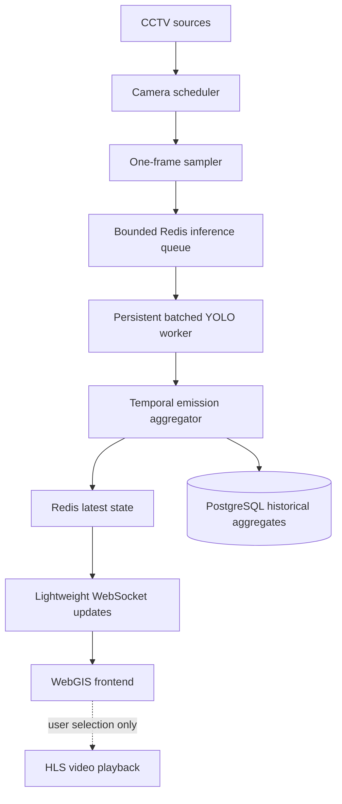

# Scalable CCTV Processing Pipeline

This document describes the refactored CCTV-to-emission architecture and the
limits of the included load simulator.

## Runtime architecture



Video playback remains a separate, on-demand browser path. Camera scheduling
does not depend on whether a user has opened a video.

## Responsibilities

- The scheduler selects only active, due cameras, preserves deterministic
  staggering, applies priority, and bounds dispatches per tick.
- The sampler opens one stream, captures one frame with timeouts, releases the
  stream, and places only a short-lived frame reference in the inference job.
- Redis reservations bound pending work and prevent duplicate camera jobs.
- One persistent detector lifecycle feeds a configurable micro-batcher.
- Emission calculations retain the existing vehicle classes, pollutants,
  factors, units, and formulas.
- Snapshot counts are averaged inside fixed capture-time windows. Emission
  rates are recalculated from those mean counts; snapshots are not summed.
- Redis stores current aggregate state under `emission:camera:{camera_id}`.
- PostgreSQL stores completed aggregate windows in `emission_aggregates`.
- WebSocket messages contain the compact latest aggregate state, not frames,
  bounding boxes, or raw YOLO diagnostics.

## Health, retry, and freshness

Frame capture results update `last_sample_at`, `last_success_at`,
`last_error_at`, `failure_count`, and camera health. Consecutive failures use
bounded exponential backoff and transition from `degraded` to `offline`.
Successful capture resets the state to `active`.

Freshness is independent of camera health:

- `fresh`: age up to 30 seconds
- `aging`: age from 31 through 90 seconds
- `stale`: age above 90 seconds
- `unknown`: no successful observation exists

Thresholds and retry limits are configurable.

## Primary configuration

| Setting | Default |
|---|---:|
| `CAMERA_HIGH_INTERVAL_SECONDS` | 10 |
| `CAMERA_MEDIUM_INTERVAL_SECONDS` | 60 |
| `CAMERA_LOW_INTERVAL_SECONDS` | 60 |
| `CAMERA_SCHEDULER_MAX_DISPATCH_PER_TICK` | 8 |
| `CAMERA_RETRY_BASE_SECONDS` | 5 |
| `CAMERA_RETRY_MAX_SECONDS` | 60 |
| `CAMERA_FAILURES_BEFORE_OFFLINE` | 4 |
| `INFERENCE_QUEUE_MAX_PENDING` | 64 |
| `INFERENCE_MAX_BATCH_SIZE` | 8 |
| `INFERENCE_MAX_BATCH_WAIT_MS` | 200 |
| `INFERENCE_WORKER_CONCURRENCY` | 8 |
| `EMISSION_AGGREGATION_WINDOW_SECONDS` | 60 |
| `LATEST_EMISSION_STATE_TTL_SECONDS` | 3600 |
| `DATA_FRESH_THRESHOLD_SECONDS` | 30 |
| `DATA_AGING_THRESHOLD_SECONDS` | 90 |

## Migrations

- `8f0c3a9d71b2`: camera scheduling and priority fields
- `b9e10c4d2a7f`: historical emission aggregate table
- `c11a4e9f7b2d`: camera health and failure tracking

Apply them with `alembic upgrade head` before starting the refactored workers.

## Automated checks

Backend tests cover scheduling, frame capture isolation, bounded reservations,
detector reuse, batching, aggregation semantics, latest state, historical row
mapping, health/backoff, freshness, and the aggregate pipeline flow. Frontend
verification uses ESLint and TypeScript.

## Workload simulator

Run the default stages from the repository root:

```powershell
$env:PYTHONPATH="backend"
python -B backend/scripts/simulate_cctv_load.py
```

The simulator uses the real scheduling, batching, emission calculation,
aggregation, latest-state serialization, and freshness services. It uses a
virtual camera clock, synthetic frame availability, and synthetic batch
latency. Work still passes through a real bounded in-process queue and worker
threads.

### Measured synthetic results

Run date: 2026-08-21. Each stage represented 120 virtual seconds with a 2%
stream failure probability, 64 pending-job capacity, eight submitter threads,
batch size eight, and a 10 ms wall-clock scale per virtual second.

| Cameras | Scheduled | Successful | Failures | Overload skips | Peak queue | Mean queue wait | P95 queue wait | Mean batch | Throughput |
|---:|---:|---:|---:|---:|---:|---:|---:|---:|---:|
| 5 | 30 | 30 | 0 | 0 | 2 | 0 ms | 0 ms | 2.067 | 22.06 jobs/s |
| 10 | 40 | 40 | 0 | 0 | 2 | 1.975 ms | 16 ms | 1.850 | 29.78 jobs/s |
| 20 | 80 | 79 | 1 | 0 | 3 | 0.405 ms | 0 ms | 2.215 | 54.98 jobs/s |
| 40 | 161 | 159 | 2 | 0 | 4 | 0.692 ms | 0 ms | 3.453 | 103.79 jobs/s |
| 56 | 235 | 231 | 4 | 0 | 7 | 1.619 ms | 16 ms | 4.810 | 145.01 jobs/s |

The 56-camera stage was extended to 600 virtual seconds. It processed 1,151
jobs with 29 simulated stream failures, zero overload skips, peak queue depth
7/64, mean queue wait 1.199 ms, p95 queue wait 15 ms, and mean batch size
4.183. Queue depth remained bounded throughout this synthetic workload.

An overload probe using 56 cameras, zero pacing, and queue capacity eight
reported 221 explicit overload skips, peak depth 8/8, 12 successful jobs, and
46 cameras with no data. This verifies overload is accounted for rather than
reported as successful processing.

### Measurement limits

These results validate orchestration and backpressure behavior only. They do
not prove production capacity for 56 cameras because this environment did not
measure real CCTV network latency, FFmpeg/OpenCV decoding, YOLO inference,
GPU memory/utilization, Redis/PostgreSQL network I/O, process RSS, or browser
WebSocket fan-out. `python_heap_peak_mib` is `tracemalloc` Python allocation
peak, and CPU percentage is process CPU time divided by wall time.

Before production sizing, repeat the same 5/10/20/40/56 progression with the
deployment model and representative streams while collecting host CPU/RSS,
GPU telemetry, Redis memory, database write latency, queue depth, and camera
freshness.
